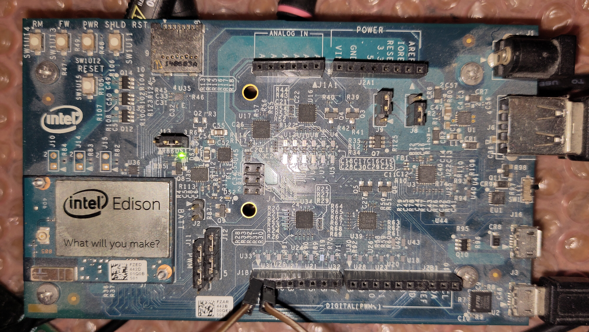

# Fixing up a fried step-down converter on the Edison-Arduino

With multiple Edison-Arduino boards we found the switching regulator that supplies the 5V is easily fried. We have not been able to determine the root cause, but the fact is we fried 3 boards over a time period in exactly the same way.

Here is the culprit U1:

and part of the schematic page where it is used:

For those having a hard time reading schematics:
 1. On the left is the jack where you plug a 7V - 15V supply
 2. This is followed by a blocking diode CR7 to protect against reverse polarity and at the same time to block reverse powering the supply when an alternative supply is connected to VIN (which has is own blocking diode CR6).
 3. This is followed by a step-down converter (a switching regulator) U1 that provides 5V through blocking diode CR2. Alternatively this 5V can be delivered from VBUS (from the uUSB  connectors).
 4. Assuming CR2 is still functional (we need that because U1 has turned into a short circuit to GND), we could connect a 5V supply directly to the 5V (directly to the right of CR2).

## Before doing this make sure the power supply is 5.0V and delivers 1A (or so)
  * We used a USB charger.

## Be sure you get the polarity right
  * Or you will fry a whole lot more!

You can plug it directly into the POWER header pin 5 (+5V) and 6 (GND). Note the triangle on the right points to pin 1.

or solder it to the back side as we did (and then tie wrapped it to one of the plastic studs as a strain relief).

Note the square pin on the left with the triangle pointing to it is pin 1.

